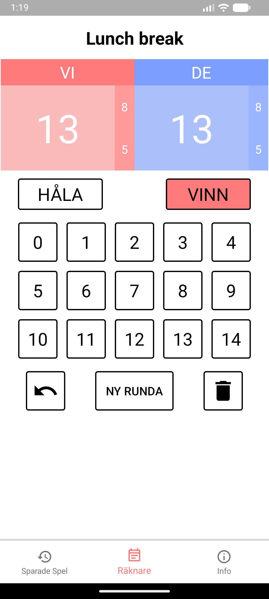
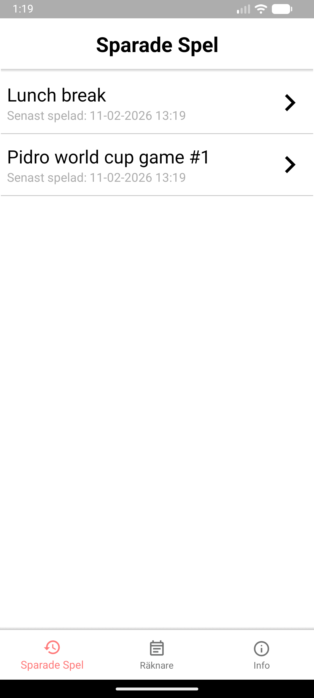

# Pidro-räknare

This is an android app for tracking your scores in the card game Pidro! It features a basic score input method as well as a database to keep track of previously played games.

## Screenshots

## Download
This project used to be on the Play Store, but is now distributed through binaries in GitHub releases.
